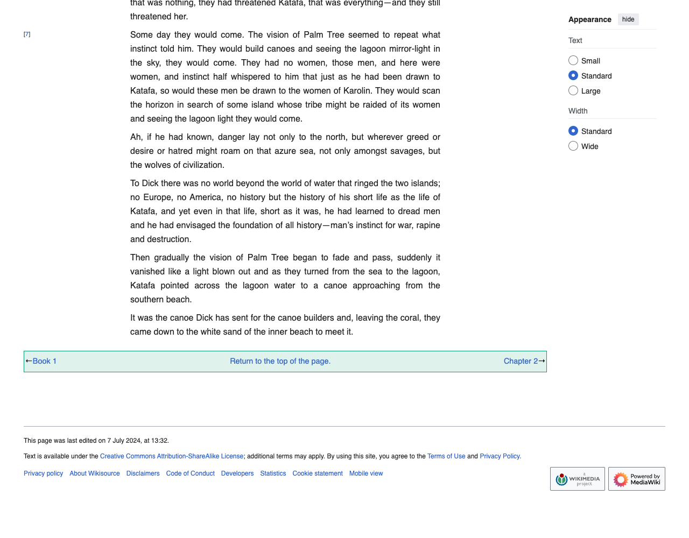

# 📘 Softnerve: Automated Book Publication Workflow

---

## 🚀 Project Title

**softnerve**

---

## 📄 Project Description

This project is a comprehensive AI-powered pipeline developed for the Softnerve AI Internship assignment. It enables automated book content processing using modern NLP tools, reinforcement learning, and vector search.

This project scrapes book content from a public web URL, rewrites ("spins") it using a large language model (LLM), and refines the output through human-in-the-loop feedback. Every version is scored, rewarded, and stored in a vector database with version tracking and semantic search support.

### 🌐 Core Objectives

- Fetch web content and screenshots
- Apply AI "spins" to book chapters using Gemini API
- Review, log, and refine content via human feedback
- Calculate a reward using RL-based logic
- Store all versioned content in ChromaDB
- Surface the best chapter version via intelligent querying

---

## ✨ Features

- 🔍 **Web Scraping & Screenshots**:
  Uses Playwright to fetch chapter content and a full-page PNG screenshot of the chapter at [The Gates of Morning – Chapter 1](https://en.wikisource.org/wiki/The_Gates_of_Morning/Book_1/Chapter_1)

- 🧠 **AI Chapter Spinning and Review**:
  Uses Gemini API to rewrite and review scraped chapters. The AI also gives a score out of 10 for the rewritten content.

- 🗃️ **File Storage**:
  All AI-generated content and reviews are saved as `.txt` and `.json` files locally.

- 🎯 **Reward Engine**:
  Combines human feedback and AI scores to calculate a final reward:

  ```python
  reward = (score + AI_score) / 2
  +2 if approved
  +1 if tone_ok
  +3 if recommend_for_publishing
  ```

  Final reward is stored and logged.

- 🧠 **Reinforcement Learning Logic**:
  Determines the best chapter version using a Q-table:

  ```python
  def suggest_action(q_table):
      avg = np.mean(list(q_table.values()))
      if avg > 12: return "exploit"
      elif avg < 6: return "explore"
      return "balance"
  ```

  - `explore`: try a new AI spin
  - `exploit`: stick with the best-performing version
  - `balance`: do both intelligently

- 📚 **ChromaDB Integration**:
  Stores all chapter versions as vector embeddings with metadata. Retrieves the one with the highest reward.

- 🔁 **Main Pipeline Automation**:
  `main.py` orchestrates the entire flow — scraping, rewriting, review, reward, and ChromaDB storage — and logs everything neatly to the CLI.

---

## 🛠 Installation Instructions

```bash
git clone https://github.com/parthgrover18/softnerve.git
cd softnerve
pip install playwright chromadb google-generativeai python-dotenv
```

Make sure to also install required native packages for `playwright`:

```bash
playwright install
```

---

## 🧪 Usage

After configuring your `.env` file (see below), simply run:

```bash
python main.py
```

- All logs will print to the terminal
- Final rewards and best-performing chapters will be shown
- Data will be saved in `/data` folders

Screenshots and detailed usage examples are included in the repository.

---

## 💻 Technologies Used

- Python 3.x
- Gemini API (LLM)
- ChromaDB (Vector database)
- Playwright (Web scraping and screenshots)
- Reinforcement Learning
- NumPy, JSON, dotenv, logging

---

## ⚙️ Configuration

A `.env` file is required at the root level:

```env
URL=https://en.wikisource.org/wiki/The_Gates_of_Morning/Book_1/Chapter_1
API_KEY=your_api_key_here (gemini API key)
```

---

## 👤 Author

**Parth Grover**  
📧 parthgrover1818@gmail.com  
🔗 [LinkedIn](https://www.linkedin.com/in/parth-grover-4ab168232/)

---

## 📝 License

This project is submitted for evaluation purposes only.  
The developer retains all rights.  
Softnerve holds no commercial interest in this project.

No AI tools were used in writing the final submission.

---

## 📸 Screenshots and video





.png>)
.png>)
.png>)
.png>)


---
